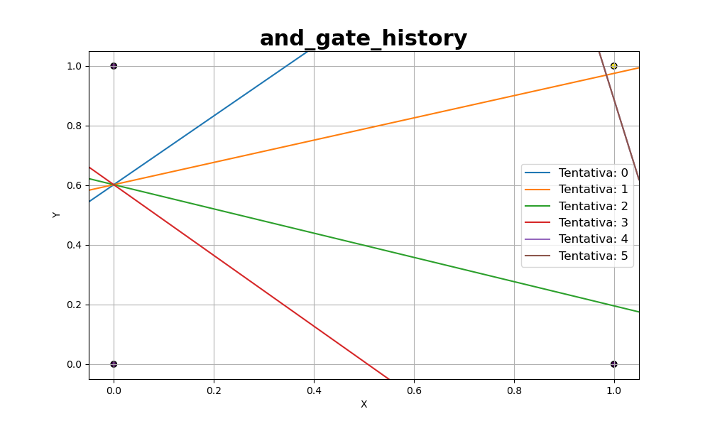
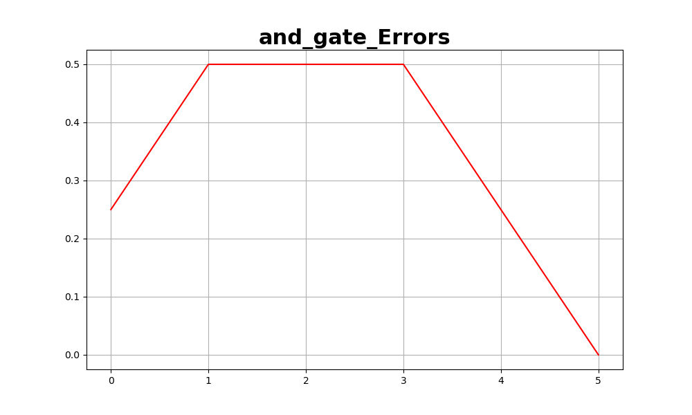

# Perceptron

Este repositório contém uma implementação simples do Perceptron, um algoritmo de aprendizado de máquina básico usado para classificação binária.

O Perceptron é um modelo de neurônio artificial que recebe entradas, calcula uma combinação linear ponderada delas, aplica uma função de ativação e retorna uma saída. Ele pode aprender a classificar corretamente exemplos de treinamento por meio de um processo de ajuste dos pesos e do bias.

## Estrutura do Repositório

- `Perceptron.py`: Implementação do Perceptron.
- `utils/`: Pasta contendo utilitários auxiliares.
- `Results/`: Pasta para armazenar os resultados dos testes.
- `main.py`: Script principal para executar os testes do Perceptron.

## Dependências

- Python 3
- numpy
- pandas
- scikit-learn
- matplotlib

## Como Usar

1. Clone este repositório: git clone https://github.com/Gustavo01rb/Redes_Neurais.git
2. Navegue até o diretório clonado: cd 01-Perceptron/
3. Instale as dependências:
    * numpy -> 1.21.5
    * pandas->1.4.4
    * scikit_learn->1.0.2
    * tabulate->0.8.10
    * Lembre-se de instalar as dependências da pasta Utils também

~~~
pip install -r requirements.txt 
~~~
>Comando para instalar as dependências
4. Execute o script `main.py` para executar os testes:

## Testes

O script `main.py` executa quatro testes diferentes usando o Perceptron:

1. Teste usando o conjunto de dados `make_classification` do scikit-learn. Ele gera um conjunto de dados de classificação com duas características e separabilidade de classe.

2. Teste usando a porta lógica OR. Ele usa uma tabela de verdade da porta lógica OR como dados de entrada.

3. Teste usando a porta lógica AND. Ele usa uma tabela de verdade da porta lógica AND como dados de entrada.

4. Teste usando a porta lógica XOR. Ele usa uma tabela de verdade da porta lógica XOR como dados de entrada.

Os resultados dos testes são salvos na pasta `Results/`.

## Resultados

### Porta And

    

        
        
Resultado

    

    

        
        
Histórico de tentativas

    

    

        
        
Taxa de erro durante a execução

    

## Personalização

Você pode personalizar o Perceptron alterando os parâmetros e os dados de entrada nos testes dentro do arquivo `main.py`. Além disso, é possível modificar o comportamento da função de ativação no arquivo `Perceptron.py` para implementar outras funções de ativação, se necessário.

## Contribuindo

Contribuições são bem-vindas! Se você tiver sugestões, melhorias ou correções, sinta-se à vontade para abrir uma issue ou enviar um pull request.

## Licença

Este projeto está licenciado sob a [MIT License](../LICENSE).

