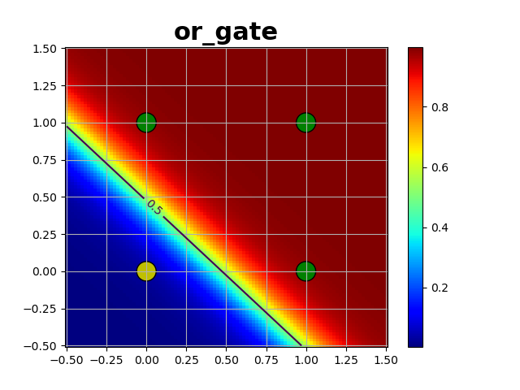

## MLP (Perceptron Multicamadas)

O MLP (Perceptron Multicamadas) é um algoritmo de aprendizado de máquina que consiste em uma rede neural artificial com várias camadas de nós interconectados. Essa arquitetura permite que o MLP aprenda a mapear entradas para saídas desejadas por meio do ajuste dos pesos das conexões entre os nós.

### Estrutura do Projeto

- `mlp.py`: Este arquivo contém a implementação do MLP para classificação. Ele inclui a definição da classe MLP, que possui métodos para treinar a rede, realizar predições e calcular a pontuação do modelo.

- `../utils.py -> ActivationFunction`: Este arquivo contém as implementações das funções de ativação utilizadas pelo MLP. Ele fornece as funções sigmoidal, linear, relu e tanh, juntamente com suas derivadas.

- `main.py`: Este arquivo é usado para testar o MLP com diferentes portas lógicas, como AND, OR e XOR. Ele cria uma instância do MLP, treina o modelo com os dados de entrada e saída fornecidos e exibe os resultados em gráficos.

- `../utils.py -> display_mlp`: Este arquivo contém uma função chamada `display_mlp` que plota o resultado do MLP e opcionalmente os erros de treinamento.

### Dependências

- Python 
- numpy
- matplotlib

### Como Acessar

1. Clone este repositório: git clone https://github.com/Gustavo01rb/Redes_Neurais.git
2. Navegue até o diretório clonado: cd 02-Mlp/
3. Instale as dependências:
    * numpy -> 1.21.5
    * matplotlib -> 3.5.2
~~~
pip install -r requirements.txt 
~~~
>Comando para instalar as dependências
4. Execute o script `main.py` para executar os testes.

### Uso do MLP

Para usar o MLP, você precisa criar uma instância da classe MLP e fornecer os parâmetros necessários, como as dimensões das camadas, taxa de aprendizado, função de ativação, entre outros. Em seguida, você pode chamar o método `fit` para treinar a rede com os dados de entrada e saída desejados. Uma vez treinada, você pode usar o método `predict` para realizar predições com base nos dados de entrada.

O arquivo main.py mostra exemplos de como usar o MLP para treinar e testar portas lógicas, como AND, OR e XOR. Ele cria uma instância do MLP, chama o método fit para treinar a rede e usa o método display_mlp da classe Graphs para exibir os resultados.


### Exemplo de Uso

Aqui está um exemplo de uso do MLP para treinar um modelo de porta lógica AND:

```python
from MLP import MLP
import numpy as np

# Dados de entrada e saída para a porta lógica AND
X_and = np.array([[0, 0],
                  [0, 1],
                  [1, 0],
                  [1, 1]])
Y_and = np.array([[0], [0], [0], [1]])

# Criar uma instância do MLP
mlp = MLP(dims=[2, 5, 1], eta=0.1, activation='sigmoid', max_epochs=4000, alpha=0.55)

# Treinar o modelo
mlp.fit(X_and, Y_and)

# Fazer previsões
predictions = mlp.predict(X_and)
```

### Testes

O script `main.py` executa três testes diferentes usando o Perceptron:

1. Teste usando a porta lógica OR. Ele usa uma tabela de verdade da porta lógica OR como dados de entrada.

2. Teste usando a porta lógica AND. Ele usa uma tabela de verdade da porta lógica AND como dados de entrada.

3. Teste usando a porta lógica XOR. Ele usa uma tabela de verdade da porta lógica XOR como dados de entrada.

Os resultados dos testes são salvos na pasta `Results/`.

### Resultados


#### And Gate
<div align="center">
    <a href = "Results/and_gate/and_gate_result.png">
        
    </a>
    <a href = "Results/and_gate/and_gate_errors.png" >
        
    </a>
</div>

#### Or Gate
<div align="center">
    <a href = "Results/or_gate/or_gate_result.png">
        
    </a>
    <a href = "Results/or_gate/or_gate_errors.png" >
        
    </a>
</div>

#### XOr Gate
<div align="center">
    <a href = "Results/xor_gate/xor_gate_result.png">
        
    </a>
    <a href = "Results/xor_gate/xor_gate_errors.png" >
        
    </a>
</div>

### Personalização

Você pode personalizar a Mlp alterando os parâmetros e os dados de entrada nos testes dentro do arquivo `main.py`. Além disso, é possível modificar o comportamento da função de ativação no arquivo `Mlp.py` para implementar outras funções de ativação, se necessário.

### Contribuindo

Contribuições são bem-vindas! Se você tiver sugestões, melhorias ou correções, sinta-se à vontade para abrir uma issue ou enviar um pull request.

### Licença

Este projeto está licenciado sob a [MIT License](../LICENSE).