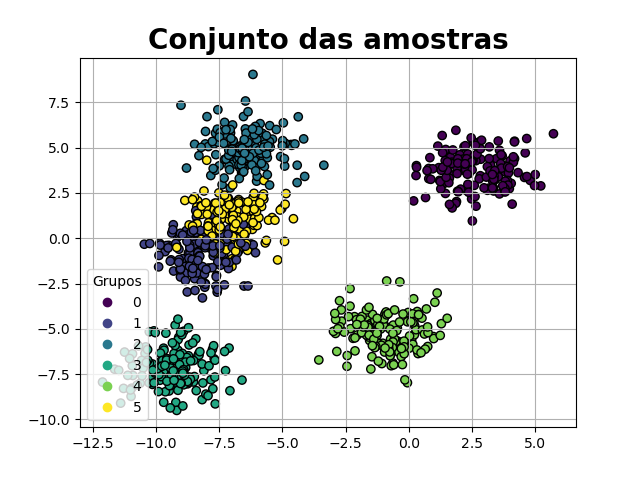
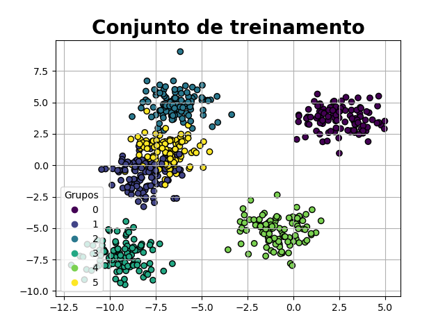
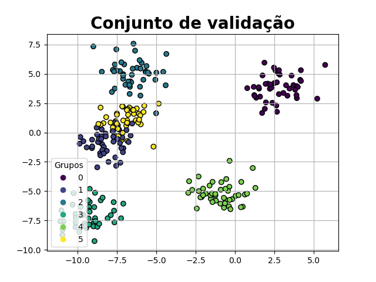

# C-Means

O C-Means é um algoritmo de clustering amplamente utilizado na área de aprendizado de máquina e análise de dados. Ele é utilizado para agrupar dados não rotulados em grupos ou clusters com base nas características dos dados.

### Descrição

Esse é um código que implementa o algoritmo C-Means em Python. O algoritmo C-Means é uma técnica de clustering, que divide um conjunto de dados em clusters, de acordo com a similaridade entre os pontos. O algoritmo utiliza a média dos valores dos atributos dos pontos para definir os centros dos clusters.

O arquivo C_means.py contém a implementação da classe C_Means, que possui métodos para realizar o treinamento do modelo e fazer predições. O método fit é responsável por treinar o modelo com base nos dados de entrada. O método predict recebe as coordenadas de um ponto e retorna o índice do centro mais próximo desse ponto. O método predict_group realiza a predição dos grupos (rótulos) para um conjunto de amostras e compara com os rótulos esperados.

O arquivo main.py utiliza a classe C_Means para realizar o treinamento e a visualização dos resultados. Ele gera um conjunto de amostras sintéticas com a função make_blobs do sklearn.datasets e separa essas amostras em conjuntos de treinamento e teste com a função train_test_split do sklearn.model_selection. Em seguida, o código chama a função runs para treinar o modelo e exibir os resultados em gráficos.

Os resultados são exibidos em gráficos usando as bibliotecas matplotlib.pyplot e as funções display_samples e display_samples_with_centers do módulo utils. O código também salva as imagens geradas em arquivos no diretório Results.

No geral, o código implementa o algoritmo C-Means e mostra como utilizá-lo para fazer clustering em um conjunto de dados.


O repositório contém a implementação do algoritmo C-Means na linguagem Python. O algoritmo pode ser executado tanto no modo supervisionado quanto no modo não supervisionado. No modo supervisionado, os rótulos dos dados são fornecidos durante o treinamento, enquanto no modo não supervisionado, o algoritmo agrupa os dados sem a necessidade de rótulos.

A implementação inclui as seguintes funcionalidades:

- Treinamento do modelo usando dados de entrada.
- Predição dos grupos (rótulos) para um conjunto de amostras.
- Cálculo da acurácia da classificação.
- Visualização dos resultados em diferentes épocas.
- Exibição de informações sobre o modelo, como o número de épocas até a convergência e a posição final dos centros.

### Estrutura do Projeto

- `C_means.py`: Este arquivo contém a implementação do algoritmo C-Means. Nele, você pode encontrar a classe C_Means com os métodos necessários para treinar o modelo, fazer previsões, exibir informações sobre o modelo e visualizar os resultados. É o arquivo central do seu algoritmo.

- `main.py`: Este arquivo contém um exemplo de uso do algoritmo C-Means. Nele, você pode gerar dados de amostra aleatórios, separá-los em conjuntos de treinamento e teste e realizar as etapas de treinamento e previsão usando a classe `C_Means` do arquivo `C_means.py`. É um arquivo útil para demonstrar como usar o seu algoritmo em um cenário prático.

- `Results/`: Este diretório é opcional e pode ser usado para armazenar os resultados das execuções do seu algoritmo, como visualizações gráficas dos grupos encontrados ou quaisquer outros dados relevantes.

- `utils.py`: Este arquivo contém as funções auxiliares de exibição de resultados.


### Requisitos

- Python
- matplotlib
- numpy
- scikit_learn

### Como Acessar

1. Clone este repositório: git clone https://github.com/Gustavo01rb/Redes_Neurais.git
2. Navegue até o diretório clonado: cd 03-C_means/
3. Instale as dependências:
    * matplotlib->3.5.2
    * numpy->1.21.5
    * scikit_learn->1.0.2

~~~
pip install -r requirements.txt 
~~~
>Comando para instalar as dependências
4. Execute o script `main.py` para executar os testes.

### Uso

1. Importe a classe `C_Means` do arquivo `C_means.py` para o seu código Python:

    ```python
    from C_means import C_Means
    ```

2. Crie uma instância do modelo C_Means e defina os parâmetros de acordo com as suas necessidades:
    ```python
    model = C_Means(supervised=False, centers=[], max_epoch=10, tol=0.02)
    ```

3. Treine o modelo usando os dados de entrada:
    ```python
    model.fit(x=x_train, y=y_train, n_centers=n_centers)
    ```

4. Faça previsões para um conjunto de amostras:
    ```python
    predictions, errors, accuracy = model.predict_group(x_test, y_test)
    ```
5. Exiba informações sobre o modelo e visualize os resultados:
    ~~~python
    model.info()
    ~~~

### Resultados

#### Amostra gerada
<div align="center">
    <a href = "Results/samples.png">
        
    </a>
    <a href = "Results/train.png">
        
    </a>
    <a href = "Results/test.png" >
        
    </a>
</div>

#### Validação
<div align="center">
    <a href = "Results/unsupervised/test/Validação não supervisionada.png">
        
    </a>
    <a href = "Results/test.png">
        
    </a>
    <a href = "Results/supervised/test/Validação supervisionada.png" >
        
    </a>
</div>

### Contribuindo
Contribuições são bem-vindas! Se você encontrar algum problema, tiver ideias de melhorias ou quiser adicionar novos recursos, fique à vontade para abrir uma issue ou enviar um pull request.

### Licença
Este projeto está licenciado sob a [MIT License](../LICENSE).