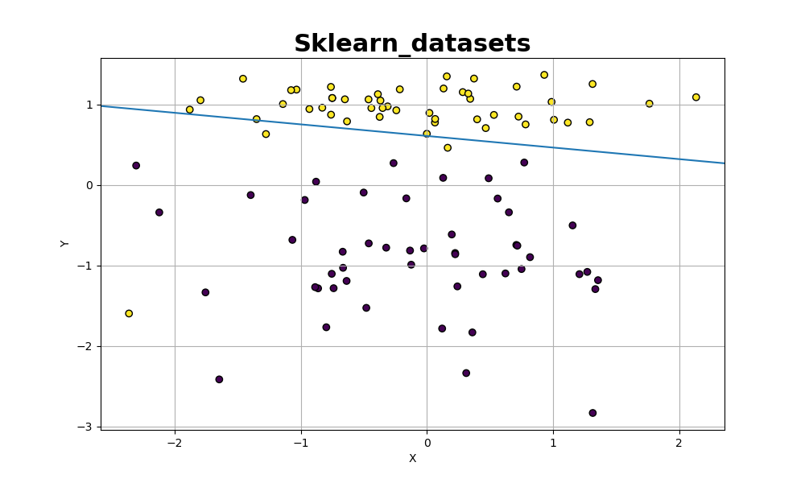

# Redes Neurais Artificiais
Este repositório contém implementações de diferentes modelos de Redes Neurais Artificiais (RNAs). Ele foi desenvolvido originalmente para a disciplina de Inteligência Computacional e agora foi documentado e organizado para facilitar o entendimento e o uso.

### Implementações

O repositório está dividido em quatro implementações principais:

* **Perceptron:** Implementação do modelo de Perceptron, um tipo simples de RNA com apenas uma camada.
[Leia mais](/01-Perceptron/)

* **MLP (Multilayer Perceptron):** Implementação do MLP, uma RNA de múltiplas camadas com uma ou mais camadas ocultas.
[Leia mais](/02%20-%20Mlp/)

* **C-Means:** Implementação do algoritmo C-Means para clustering fuzzy, uma técnica de aprendizado não supervisionado e supervisionado.
[Leia mais](/03-C_means/)

* **Neuro-Fuzzy:** Implementação de um sistema Neuro-Fuzzy que combina redes neurais e lógica fuzzy para resolver problemas de regressão.
[Leia mais](/04-Neuro_fuzzy/)

### Como Usar
Cada implementação possui seu próprio diretório com um arquivo README.md contendo informações detalhadas sobre o modelo e como utilizá-lo. Para usar qualquer uma das implementações, basta seguir as instruções descritas no respectivo README.md de cada diretório.

Para começar, você pode selecionar a implementação desejada e explorar as funcionalidades oferecidas. Certifique-se de ter as dependências necessárias instaladas antes de executar os códigos das implementações.

### Alguns resultados:

    
    
Perceptron

    
    
MLP

    
    
C means

    
    
Neuro Fuzzy

    

### Contribuição
Sinta-se à vontade para contribuir para este repositório caso tenha melhorias, correções ou novas implementações relacionadas a Redes Neurais Artificiais. Basta enviar um pull request e analizarei a revisão o mais rápido possível.

### Licença
Este repositório é licenciado sob a MIT License. Sinta-se livre para utilizar o código aqui disponível conforme necessário.
Espero que este repositório seja útil para sua compreensão e aplicação das Redes Neurais Artificiais. Se tiver alguma dúvida, não hesite em entrar em contato.
Divirta-se explorando e construindo suas próprias aplicações de RNAs!

---

&nbsp;
&nbsp;
&nbsp;
&nbsp;
                                     